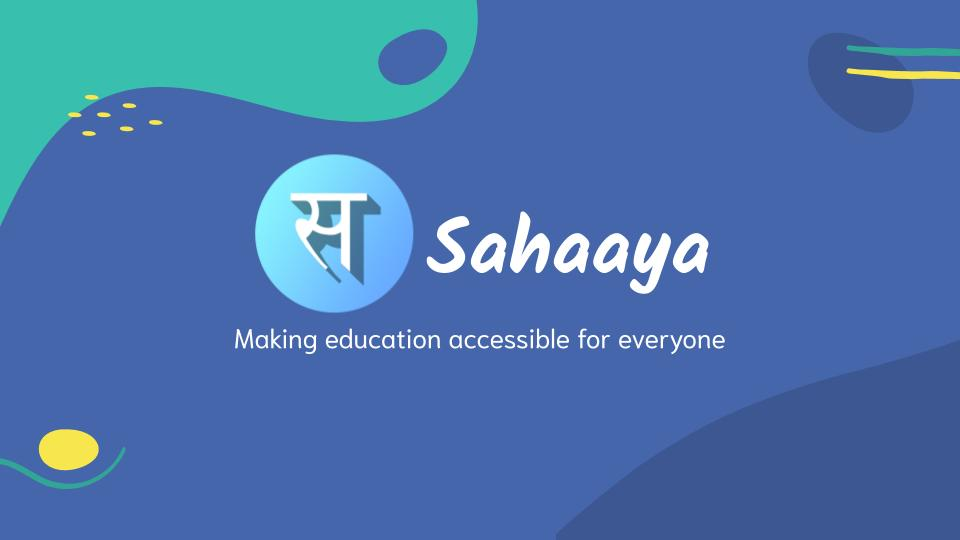

# Sahaaya

Sahaaya is an education accessibilty app to help students with vision and learning disorders like dyslexia so the they can read any form of text easily. It is based on a research study from 2012. The features we provide are :

  - Multiple reading modes
  - 13 indian languages
  - text to speech
  

